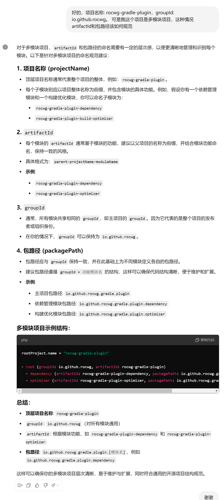

[source,php]
----
rootProject.name = "rocwg-gradle-plugin"

- root (groupId: io.github.rocwg, artifactId: rocwg-gradle-plugin)
  - dependency (artifactId: rocwg-gradle-plugin-dependency, packagePath: io.github.rocwg.gradle.plugin.dependency)
  - optimizer (artifactId: rocwg-gradle-plugin-optimizer, packagePath: io.github.rocwg.gradle.plugin.optimizer)

----